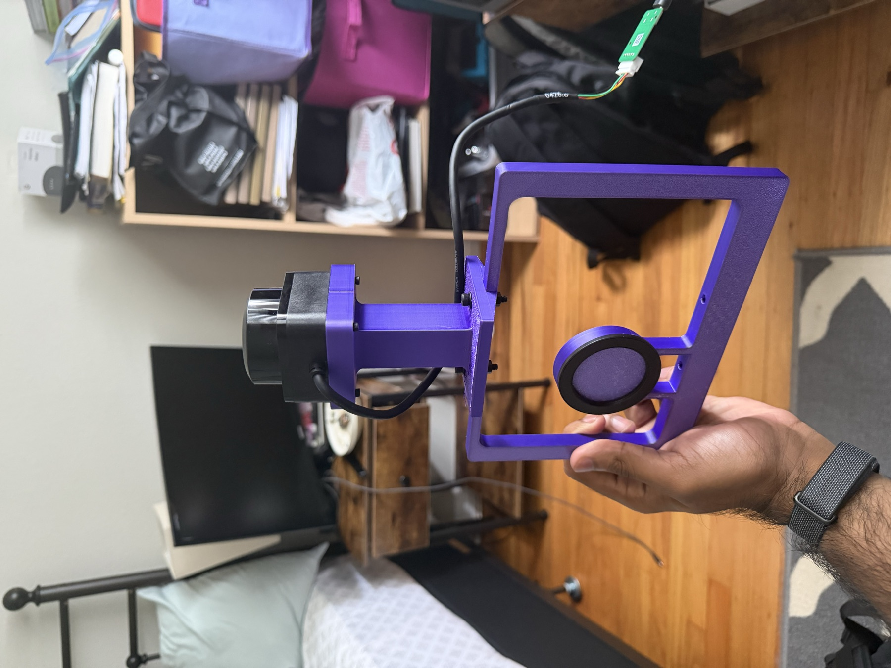
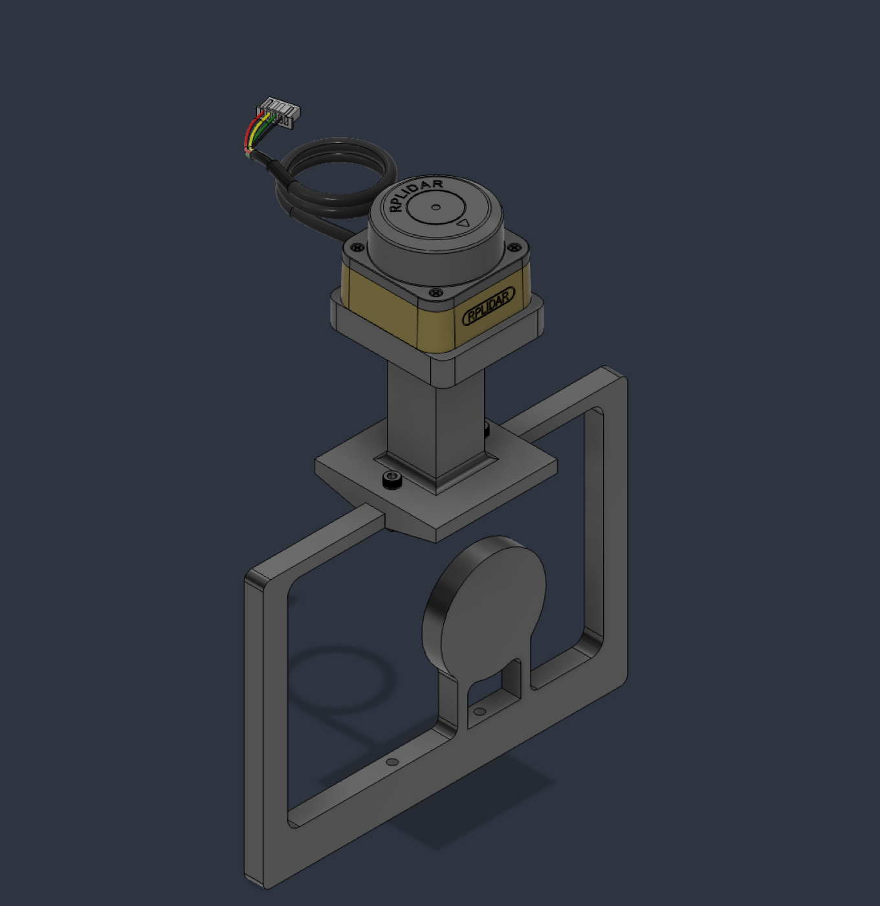
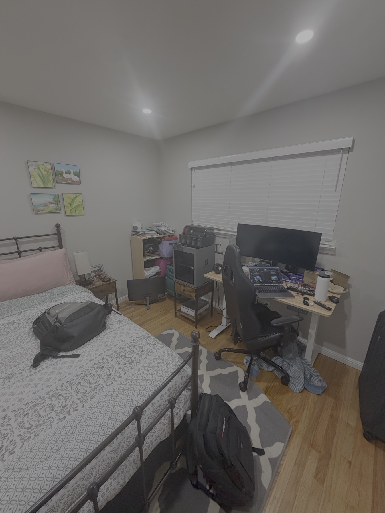
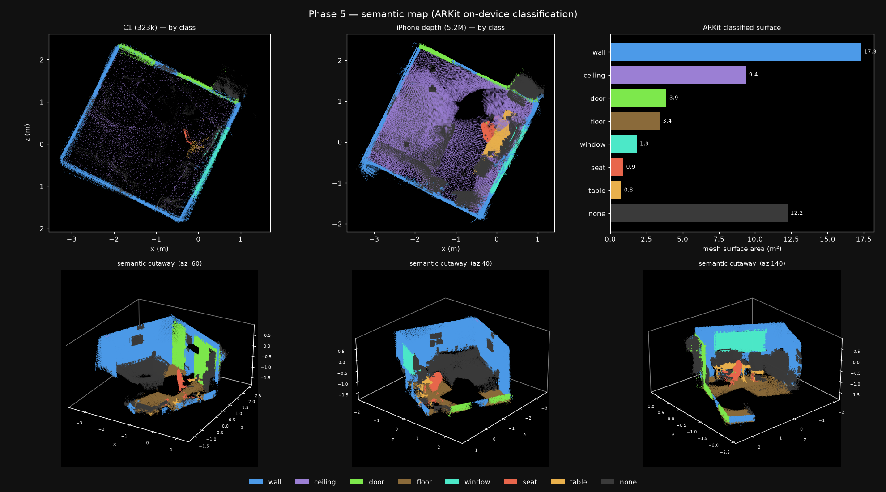
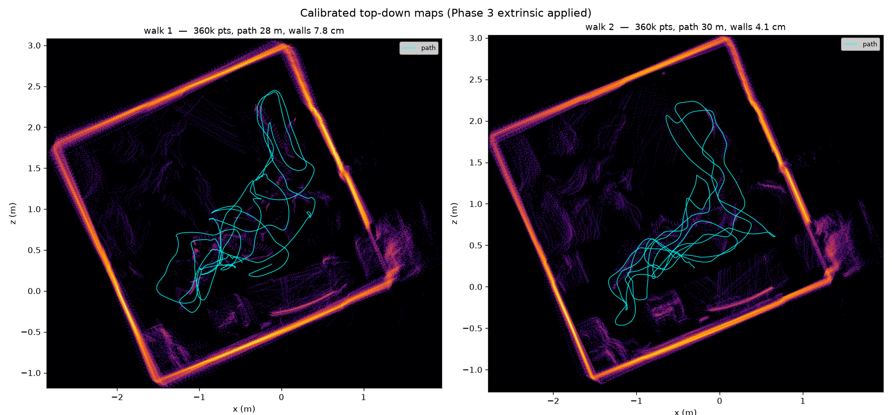
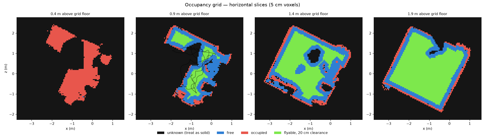

# Semantic Scanning

**A handheld 3D semantic mapping rig — 360° lidar fused with an iPhone's LiDAR and visual-inertial odometry — built as the mapping front-end for autonomous indoor drone navigation.**

Custom hardware, a native iOS capture app, and a full Python fusion pipeline: sensor transport, time synchronisation, extrinsic calibration, pose-graph SLAM, semantic labelling, and a 3D occupancy grid for path planning.

<p align="center">
  
  
  
</p>
<p align="center"><em>The rig · the CAD design · the room it scanned</em></p>

---

## Result

A metrically accurate, semantically labelled 3D map of a real room — produced from a 90-second handheld walkthrough.



*ARKit's on-device mesh classification projected onto both point clouds. Blue walls, green **door**, brown floor, cyan **window**, red seat, orange table. 147,791 classified faces across all eight categories.*



*Two independent 90-second walks, same calibration. Sharp single-line walls, furniture, and the walked trajectory — the two captures reproduce the same room to within centimetres.*

---

## Numbers

| Metric | Result |
|---|---|
| Wall thickness after drift correction | **3.4 cm**, consistent across independent walks |
| Extrinsic calibration reproducibility | **1.3 cm** translation, **0.7°** rotation, cross-validated |
| Clock model timing error | **1.15 ms** over a 43 s segment |
| Sensor noise floor (measured) | **0.39 cm** |
| Dense cloud | **5.2 M** points per 90 s capture |
| Semantic faces | **147,791** across 8 classes |
| Navigable volume | 18.4 m³ free · **6.5 m³** flyable at 30 cm drone clearance |

Every figure is cross-validated across independent recordings rather than measured once.

---

## How it works

```
RPLidar C1 ──USB──> MacBook <──USB (usbmuxd)── iPhone 17 Pro
  360° planar          fusion pipeline          ARKit VIO, LiDAR depth,
  12 m range           (Python/NumPy/SciPy)     semantic mesh
```

The iPhone cannot read the lidar directly — iOS exposes no public serial API — so the Mac hosts the lidar and the phone streams over a TCP tunnel through `usbmuxd`. The phone acts as a sensor; all fusion runs on the Mac.

**The two sensors are genuinely complementary**, and the semantic labelling made it measurable: the lidar sees only 0.1% floor (it sweeps horizontally) while the phone sees 2.7%; the lidar has 2.9% unlabelled points against the phone's 0.0%, because it sweeps 360° and captures geometry the camera never looked at.

### Pipeline

| Stage | What it solves |
|---|---|
| **Transport** | Dual-sensor streaming, per-stream threads, arrival timestamping |
| **Record / replay** | Deterministic lossless capture, so every later stage iterates on a file |
| **Time sync** | Clock offset, skew, and lidar lag between two independent clocks |
| **Extrinsics** | 6-DoF lidar↔camera transform, solved jointly with the residual time offset |
| **Fusion** | Per-sample deskewing, 2D pose graph, ICP loop closure, dense depth unprojection |
| **Semantics** | ARKit mesh classification projected onto both clouds |
| **Occupancy** | Ray-carved free/occupied/**unknown** grid for path planning |

---

## Engineering highlights

**The clocks are a sawtooth, not a line.** The phone and Mac clocks diverge at 380 ppm and resynchronise every 43 s, stepping back by exactly the accumulated 16.30 ms (sd 0.53, n=9). A single linear fit gave answers ranging from −387 to +851 ppm on identical hardware. Three competing explanations — a backed-up send queue, NTP slew, motion-dependent latency — were each tested and eliminated before the real cause was found. The model is now piecewise-linear, split at detected resyncs.

**Never replace good odometry.** Building pose-graph edges by scan-matching consecutive keyframes made the map 3× worse. Over a 1-second gap, ARKit's VIO is accurate to millimetres while 2D ICP on a sparse planar slice disagrees by 2.3 cm / 1.0° — chaining 100 of those wrecks the trajectory. Isolated in one test: feeding the graph only ARKit edges reproduced the input to **0.00 mm**, proving the optimiser was correct and the *edges* were wrong. VIO now provides odometry; lidar provides only loop closure.

**Loop closures need a sanity gate.** A near-square room has ~4-fold rotational symmetry, so ICP can lock onto a 90°-rotated alignment that scores *better* than the truth. Unguarded, 2133 of 2232 edges were accepted as valid closures.

**Verification over assumption.** The Swift and Python wire-format encoders were validated by compiling the Swift standalone and diffing its bytes against Python's. Depth unprojection was checked against synthetic ground truth. The time-offset estimator was tested by injecting known delays and measuring recovery — which revealed it was accurate to ±0.1 ms on clean data and carried 5 ms of bias on marginal data, so the acceptance threshold was raised on evidence rather than intuition.

**A physically "impossible" result that was correct.** Calibration placed the lidar 25 cm *below* the camera, contradicting the CAD. It reproduced across two independent recordings to 1.3 cm. The cause: the phone is mounted sideways, and ARKit's camera frame is device-fixed — measuring world-up in the camera frame gave −Y at |cos| = 0.99, confirming −25 cm along Y *is* 25 cm up. Clamping it to the "sensible" value would have baked in a 35 cm error that the pose graph would have silently absorbed into the trajectory.

---

## Built for drone navigation

This is **part 1**. The goal is autonomous point-to-point drone flight through a scanned house, which changes what "good enough" means.



*Occupancy slices at four heights. Black is unknown and must be treated as solid; green is flyable with 20 cm clearance.*

A point cloud records where surfaces *are* and says nothing about where it is safe to fly. Free space has to be **carved** by ray-casting from sensor poses, with anything unobserved left explicitly unknown. Three findings shape the drone side:

- **Height dominates navigability.** At 0.4 m almost nothing is navigable; at 1.9 m almost everything is.
- **Clearance is the binding constraint.** A 30 cm drone loses 65% of the free space.
- **Unknown pockets sit inside the room**, not only behind walls — a planner must refuse to route through them.

Known sensing limits, honestly: both sensors are near-IR and largely blind to glass and thin obstacles like wires and chair legs. That is a hardware limitation, not a software one, and any flight system needs onboard local avoidance regardless of map quality.

---

## Stack

**Hardware** — RPLidar C1, iPhone 17 Pro, custom CAD-designed 3D-printed mount

**iOS** — Swift, ARKit (world tracking, scene depth, mesh classification), Network.framework

**Pipeline** — Python, NumPy, SciPy, custom binary wire protocol over usbmuxd

**Techniques** — visual-inertial odometry, pose-graph SLAM, ICP scan matching, RANSAC plane fitting, Theil–Sen robust regression, log-odds occupancy mapping, clock synchronisation

---

## Status

| Stage | State |
|---|---|
| Transport, recording, time sync | ✅ Complete |
| Extrinsic calibration | ✅ Cross-validated |
| Pose-graph fusion + dense depth | ✅ Complete |
| Semantic labelling | ✅ 8 classes |
| Occupancy grid | ✅ Complete |
| **External accuracy validation** | 🔄 Measurement tooling built; tape-measure comparison pending |
| Multi-room registration | ⬜ Planned |

Accuracy figures above are **self-consistency and cross-sensor agreement**. Validation against physical tape measurements is the current work — until it lands, no claim is made about absolute accuracy.

---

## Documentation

Full engineering write-up, including every failed hypothesis and how it was eliminated: **[docs/ENGINEERING.md](docs/ENGINEERING.md)**

Each pipeline stage has its own README documenting its gate, its results, and the bugs it caught.
